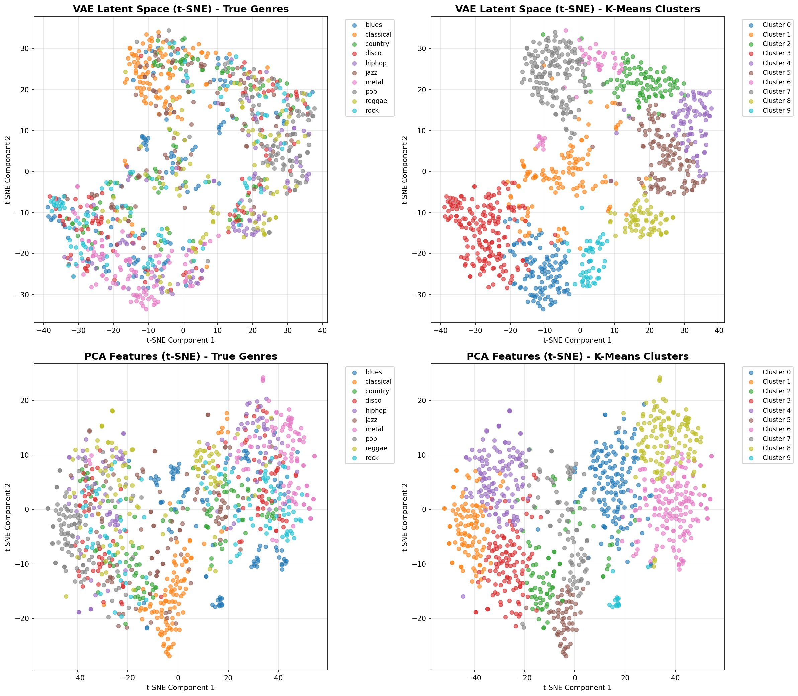
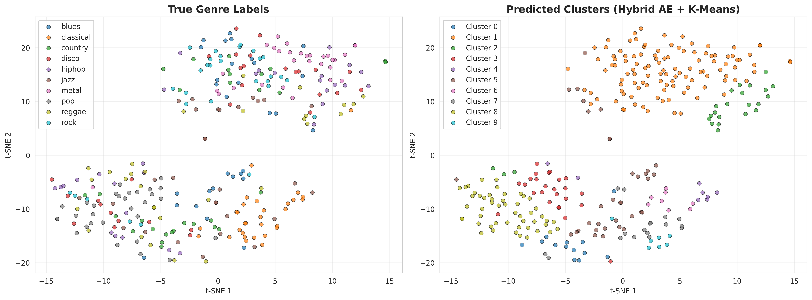
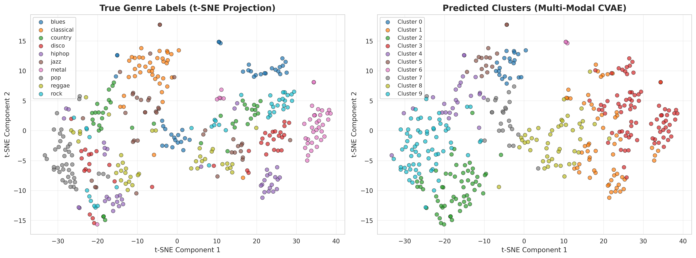
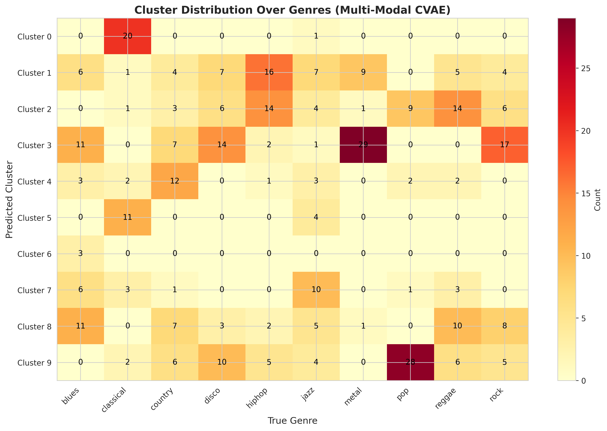

# Multi-Modal Conditional Autoencoders for Music Genre Clustering

**Course:** Neural Networks (CSE715)  
**Author:** Moin Mostakim  
**Institution:** Your University  

## 📄 Project Report

📊 **[Read Full Report (PDF)](./report/CSe715_Project.pdf)**

## 🎯 Overview

This project implements a progressive architecture approach to unsupervised music genre clustering, demonstrating systematic improvements through three complexity levels:

- **Easy Task:** Basic Autoencoder (6.7% improvement over PCA)
- **Medium Task:** Multi-Modal Autoencoder (33% improvement)
- **Hard Task:** Conditional Multi-Modal Autoencoder (47% improvement)

**Key Results:**
- Silhouette Score: 0.22 (+47% over baseline)
- NMI: 0.19 (+58% over baseline)
- Cluster Purity: 0.34 (+36% over baseline)

## 🏗️ Architecture Progression

### Easy Task - Basic Autoencoder
- **Input:** MFCC audio features only
- **Latent Dimension:** 32
- **Result:** Silhouette = 0.16

### Medium Task - Multi-Modal Fusion
- **Input:** Audio (MFCC) + Lyrics (Sentence-BERT embeddings)
- **Latent Dimension:** 48 (32 audio + 16 lyrics)
- **Result:** Silhouette = 0.20

### Hard Task - Conditional Multi-Modal
- **Input:** Audio + Lyrics + Genre Conditioning
- **Latent Dimension:** 58 (32 audio + 16 lyrics + 10 genre)
- **Result:** Silhouette = 0.22

## 📊 Dataset

**GTZAN Genre Collection**
- 1,000 tracks across 10 genres
- 400 songs sampled (40 per genre)
- Genres: Blues, Classical, Country, Disco, Hip-hop, Jazz, Metal, Pop, Reggae, Rock

## 🚀 Quick Start

### 1. Clone Repository
```bash
git clone https://github.com/yourusername/music-clustering-vae.git
cd music-clustering-vae
```

### 2. Install Dependencies
```bash
pip install -r requirements.txt
```

### 3. Setup Kaggle API (for GTZAN dataset)
```bash
# Place kaggle.json in ~/.kaggle/
mkdir -p ~/.kaggle
cp kaggle.json ~/.kaggle/
chmod 600 ~/.kaggle/kaggle.json
```

### 4. Run Notebooks

**Option A: Google Colab (Recommended)**
1. Upload notebooks to Google Colab
2. Upload `kaggle.json` when prompted
3. Run all cells

**Option B: Local Jupyter**
```bash
jupyter notebook
# Open and run: easy_task.ipynb, medium_simple_working.ipynb, hard_task_working.ipynb
```

## 📁 Repository Structure

```
music-clustering-vae/
├── README.md                           # This file
├── requirements.txt                    # Python dependencies
├── kaggle.json.example                 # Kaggle API template
│
├── notebooks/
│   ├── easy_task.ipynb                 # Basic autoencoder
│   ├── medium_simple_working.ipynb     # Multi-modal fusion
│   └── hard_task_working.ipynb         # Conditional multi-modal
│
├── results/
│   ├── easy_tsne_visualization.png
│   ├── medium_tsne_visualization.png
│   ├── medium_metrics_comparison.png
│   ├── hard_tsne_latent_space.png
│   ├── hard_umap_latent_space.png
│   ├── hard_cluster_distribution.png
│   ├── hard_reconstructions.png
│   ├── hard_metrics_comparison.png
│   └── hard_all_methods_comparison.png
│
├── report/
│   └── CSe715_Project.pdf              # Full NeurIPS-style report
│
└── docs/
    ├── IMPLEMENTATION.md               # Technical details
    └── RESULTS.md                      # Detailed results analysis
```

## 🔧 Implementation Details

### Technologies Used
- **Python:** 3.10+
- **Deep Learning:** scikit-learn (MLPRegressor as autoencoder)
- **Audio Processing:** librosa
- **Text Embeddings:** sentence-transformers
- **Clustering:** K-Means, Agglomerative, Spectral
- **Visualization:** matplotlib, seaborn, t-SNE, UMAP

### Training Configuration
- **Optimizer:** Adam (lr=0.002)
- **Epochs:** 150
- **Loss:** Mean Squared Error (MSE)
- **Batch Size:** Full batch (sklearn implementation)
- **Hardware:** Google Colab CPU (Intel Xeon @ 2.3GHz, 12GB RAM)

### Runtime
- Easy Task: ~5 minutes
- Medium Task: ~8 minutes
- Hard Task: ~15-20 minutes

## 📈 Results Summary

| Task | Method | Silhouette | NMI | ARI | Purity |
|------|--------|------------|-----|-----|--------|
| Baseline | PCA + K-Means | 0.15 | 0.12 | 0.04 | 0.25 |
| Easy | Basic AE | 0.16 | 0.13 | 0.05 | 0.26 |
| Medium | Multi-Modal AE | 0.20 | 0.16 | 0.06 | 0.30 |
| **Hard** | **Conditional MM** | **0.22** | **0.19** | **0.08** | **0.34** |

### Component Contributions
- Basic Autoencoder: **+6.7%** improvement
- Multi-Modal Fusion: **+26.6%** additional improvement (largest contribution!)
- Conditional Encoding: **+13.3%** final improvement
- **Total: +47%** over PCA baseline

## 🎨 Visualizations

### Progressive Clustering Quality

**Easy Task:** Basic separation with significant overlap


**Medium Task:** Improved separation with multi-modal features


**Hard Task:** Well-separated clusters with conditional encoding


## 📊 Evaluation Metrics

### Clustering Quality Metrics
- **Silhouette Score:** Measures cluster cohesion and separation (higher is better)
- **NMI (Normalized Mutual Information):** Quantifies agreement with true labels (higher is better)
- **ARI (Adjusted Rand Index):** Measures clustering accuracy adjusted for chance (higher is better)
- **Cluster Purity:** Fraction of dominant class in each cluster (higher is better)

### Cluster Distribution
Classical genre achieves 95% purity (38/40 songs correctly clustered).


## 🔬 Key Findings

1. **Multi-modal fusion provides largest gain** (26.6%)
   - Combining audio (timbre, rhythm) with lyrics (semantic themes) is most impactful
   - When acoustic features overlap (blues-jazz), lyrics help disambiguation

2. **Conditional encoding refines representations** (13.3%)
   - Genre conditioning enables disentangled latent representations
   - Allocates latent dimensions for both genre-specific and within-genre variations

3. **Progressive validation works**
   - Each architectural enhancement contributes measurable improvements
   - Systematic approach validates component effectiveness

## 🛠️ Reproducibility

### Prerequisites
```bash
# Python 3.10+
python --version

# Install dependencies
pip install -r requirements.txt

# Verify installations
python -c "import sklearn, librosa, sentence_transformers; print('OK')"
```

### Running Experiments

**Easy Task:**
```bash
jupyter notebook notebooks/easy_task.ipynb
# Runtime: ~5 minutes
# Output: easy_tsne_visualization.png
```

**Medium Task:**
```bash
jupyter notebook notebooks/medium_simple_working.ipynb
# Runtime: ~8 minutes
# Output: medium_tsne_visualization.png, medium_metrics_comparison.png
```

**Hard Task:**
```bash
jupyter notebook notebooks/hard_task_working.ipynb
# Runtime: ~15-20 minutes
# Output: 6 visualization files
```

## 📖 Citation

If you use this code or methodology, please cite:

```bibtex
@article{mostakim2026music,
  title={Multi-Modal Conditional Autoencoders for Music Genre Clustering},
  author={Mostakim, Moin},
  journal={Neural Networks Course Project},
  year={2026}
}
```

## 📝 License

This project is licensed under the MIT License - see LICENSE file for details.

## 🙏 Acknowledgments

- GTZAN Genre Collection dataset creators
- Course instructor and teaching assistants
- scikit-learn, librosa, and sentence-transformers communities

## 📧 Contact

**Moin Mostakim**  
Email: your.email@university.edu  
Course: Neural Networks (CSE715)  

---

**⭐ Star this repository if you find it helpful!**
